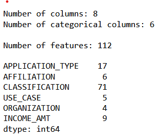
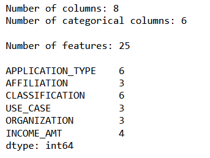
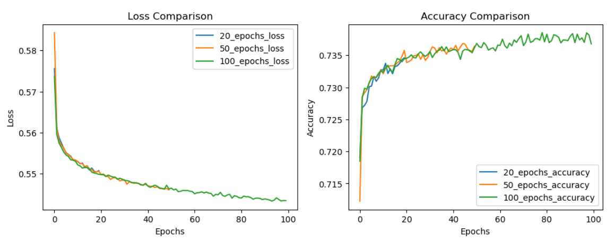
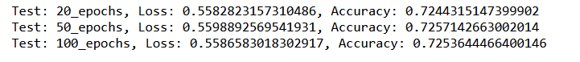
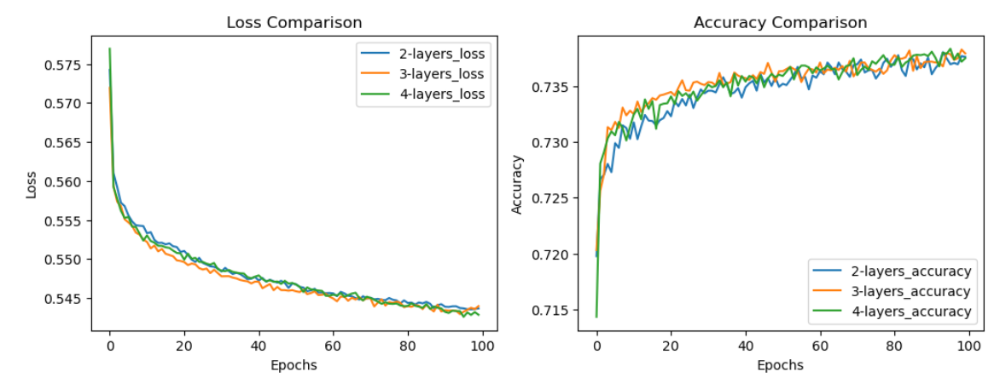
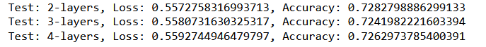
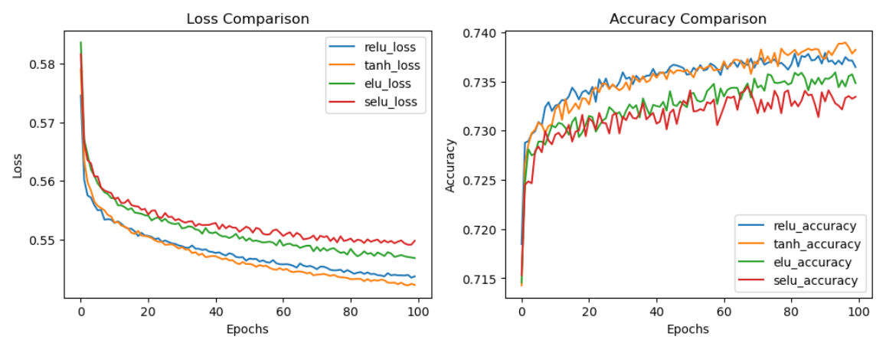
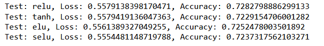
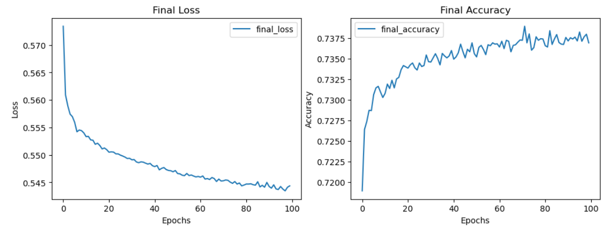
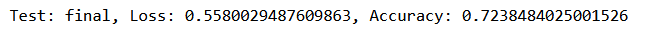

# Neural_Network_Charity_Analysis

The ask to apply neural network modeling to create a binary classifier capable of predicting whether applicants for funding from Alphabet Soup Charity will be successful if funded.

The Alphabet Soup Charity has provided significant data set based on past activity for use in the modeling. 

Goal, if possible, is to achieve model accuracy > 75%

## Initial Analysis

Initial analysis used model with 2 layers (80, 40), 100 epochs, relu activation and adam optimizer. Use this model as reference to compare with results from optimization. 

## Opitimazation Approach 1 - Feature Reduction

- Observe that the categorical features contain 1 or 2 dominate categories with other less significant categories. Approach was to reduce number of categories in each to no more than 6, with target of 3 or 4, based on categorical percentage, and place remaining categories in 'Other' category. 

- After one-hot encoding, the feature set was reduced from 112, before reduction
    - 
- To 25 after feature reduction
    - 

- Results of feature reduction, compared to reference model, was no significant improvement or degradation of accuracy. As reduced feature set model is comparable to the reference model, it was used in subsequent attempts to improve performance.

## Optimization Approach 2 - Number of Epochs

- Setup test to evaluate 3 epoch configurations for the model: 20, 50 and 100 epochs.

- Results of training
    - 

- Results of evaluation
    - 

- Conclusion : Based on accuracy result on the test set, use 100 epochs for subsequent models

## Optimization Approach 3 - Number of Layers

- Setup test to evaluate 3 layer configurations for the model: 2, 3 and 4 layers.

- Results of training
    - 

- Results of evaluation
    - 

- Conclusion : Based on accuracy result on the test set, use 2 layers for subsequent models

## Optimization Approach 4 - Activation Functions

- Setup test to evaluate 4 activation functions for the model: relu, tanh, elu, selu.

- Results of training
    - 

- Results of evaluation
    - 

- Conclusion : Based on accuracy result on the test set, use relu for final model

## Final Model, Conclusion

- Final model is based on reduced feature data set, 100 epochs, 2 layers and relu activation

- Results of training
    - 

- Results of evaluation
    - 
    
- Conclusion. Goal of 75% accuracy was not achieved. Further review of the feature relationships, as well as configuring tests that include all permutations for the above configureations or a more general parmeter search setup. 

    - Final model is saved for additional evaluation is desired.

